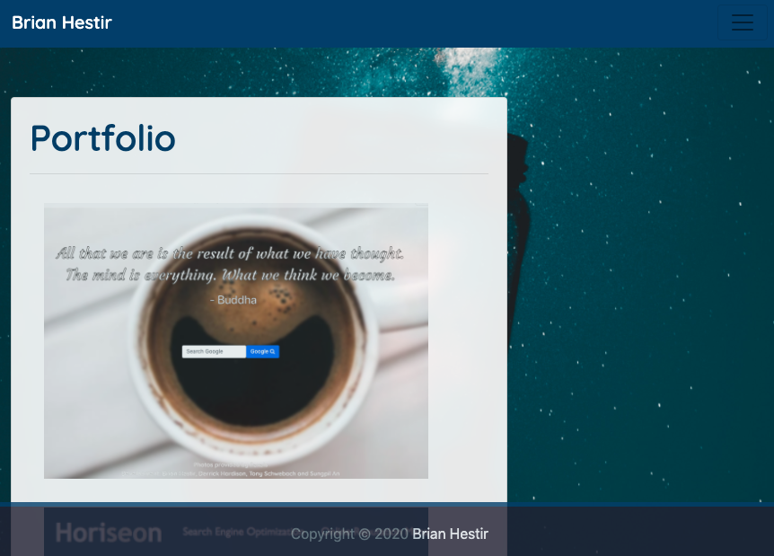

# my-portfolio

## Description
A site to showcase things learned while working with bright people while attending a Full-Stack Coding Bootcamp at Georgia Tech.

## Installation
- [Clone this repo](https://github.com/brhestir/my-portfolio.git)
- Push to GitHub
- Serve main branch via GitHub Pages.

## Usage
View the site at [my-portfolio](https://brhestir.github.io/my-portfolio/)

## Credits
- [Rakicevic Nenad, Pexels Photo](https://www.pexels.com/@rakicevic-nenad-233369)

## Licence
MIT
